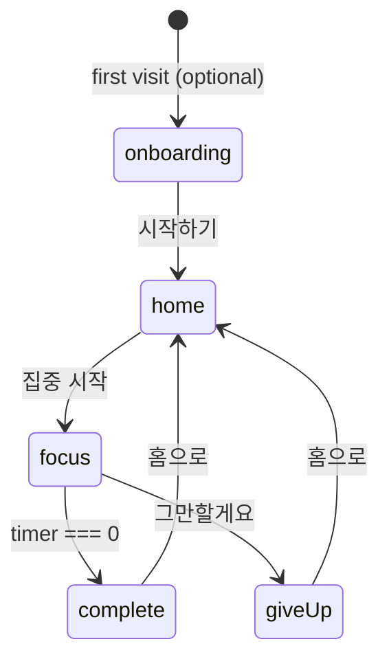

# Pause Pet — Developer Notes (Phase 1)

## 0. Purpose

Technical reference for humans and coding agents working on Pause Pet.

- **Product behavior** → `/docs/PRD.md`
- **UX / copy / visuals** → `/docs/design.md`
- **Build sequence** → `/docs/tasks.md`

---

## 1. Repository snapshot

| Item | Status |
|------|--------|
| Framework | Next.js 15 App Router |
| Language | TypeScript (strict) |
| Styling | Tailwind CSS v3 (`tailwind.config.ts`, `postcss.config.js`) |
| Config | `next.config.js` (CommonJS) |
| Persistence | Browser `localStorage` only |
| Deployment | Vercel-compatible static/SSR hybrid |

### Commands

```bash
npm install
npm run dev      # http://localhost:3000
npm run build
npm start        # production server after build
```

### Path alias

`@/*` → project root (see `tsconfig.json`).

---

## 2. What exists today (migrate from this)

### Placeholder implementation

- `components/PausePetApp.tsx` — English UI, manual “Log a pause” counter.
- `lib/types.ts` — `PetState { name, pauses, lastPauseAt }`.
- `lib/storage.ts` — key `pause-pet-state`.

**Agents should replace** this with PRD `AppState` when starting Task 1 in `tasks.md`.

### Migration hint

On load, if JSON has `pauses` but no `version`:

- Map to fresh `AppState` defaults OR map `pauses` → `completedSessions` once.
- Set `version: 1`.
- Do not crash on parse errors — fall back to defaults.

---

## 3. Target architecture (Phase 1)

```txt
app/page.tsx          # 'use client' — screen router + providers
app/layout.tsx        # metadata, global styles (server)
app/globals.css       # @tailwind directives

screens/              # one component per major screen
components/           # reusable UI (timer, pet, buttons)
lib/                  # pure TS: types, storage, date, exp, streak
hooks/                # useAppState, useFocusTimer
```

**No `app/api/` routes** for Phase 1.

---

## 4. Screen state machine



`ScreenName` type (PRD):

`onboarding` | `home` | `focus` | `complete` | `giveUp`

Keep active screen in React state in `app/page.tsx` (or a small `AppShell` client component).

---

## 5. localStorage contract

| Key | Value |
|-----|--------|
| `pause-pet-state` | JSON string of `AppState` |

### `AppState` (target)

See PRD §15. Minimum fields:

```ts
{
  version: 1,
  onboardingCompleted: boolean,
  pet: { name: string, exp: number, level: number },
  completedSessions: number,
  totalFocusMinutes: number,
  streakDays: number,
  lastCompletedDate: string | null,
  lastActiveDate: string,
  sessionInProgress: {
    durationMinutes: 15 | 25 | 45 | 60,
    startedAt: string,
    endsAt: string
  } | null
}
```

### SSR safety

```ts
if (typeof window === "undefined") {
  return defaultAppState;
}
```

Never read `localStorage` in Server Components.

Hydration pattern:

1. Render defaults on first client paint.
2. `useEffect` → load storage → set state → `hydrated = true`.
3. Persist in `useEffect` when state changes and `hydrated`.

---

## 6. Timer implementation notes

### Recommended approach

Store `endsAt` ISO timestamp when session starts.

On each tick (or on visibility resume):

```ts
const remainingMs = new Date(endsAt).getTime() - Date.now();
```

Benefits:

- Corrects drift after tab backgrounded.
- Survives short interruptions better than decrement-only counter.

### Interval

- `setInterval` 1000ms while Focus screen mounted.
- Clear interval on unmount.

### Completion

When `remainingMs <= 0`:

- Clear interval.
- Call `completeSession(state, durationMinutes)` once (guard double-fire).
- Navigate to `complete`.

### Dev testing

Optional env or constant `DEV_FOCUS_SECONDS` — **only in development**, never default in production build.

---

## 7. Business logic placement

| Concern | Module |
|---------|--------|
| EXP calculation | `lib/exp.ts` |
| Streak | `lib/streak.ts` |
| Local date `YYYY-MM-DD` | `lib/date.ts` |
| Load/save/migrate | `lib/storage.ts` |
| Korean copy strings | `lib/constants.ts` |
| React binding | `hooks/useAppState.ts` |

Keep screens thin — call lib helpers, render UI.

---

## 8. EXP and level (defaults)

From PRD:

```ts
expGained = Math.floor(durationMinutes / 5) * 5;
level = Math.floor(pet.exp / 100) + 1;
```

Centralize magic numbers in `lib/constants.ts`:

```ts
export const EXP_PER_FIVE_MIN = 5;
export const EXP_PER_LEVEL = 100;
export const FOCUS_DURATIONS = [15, 25, 45, 60] as const;
```

---

## 9. Streak (implementation sketch)

On successful completion:

1. `today = localYmd()`
2. If `lastCompletedDate === today` → streak unchanged (already counted today).
3. Else if `lastCompletedDate === yesterday` → `streakDays += 1`.
4. Else → `streakDays = 1`.
5. Set `lastCompletedDate = today`.

Use local timezone (`getFullYear`, `getMonth`, `getDate`), not UTC-only, for Korean users.

---

## 10. Give-up rules (defaults)

- No EXP.
- No `completedSessions` increment.
- No minutes added to `totalFocusMinutes`.
- Clear `sessionInProgress`.
- Do not decrement `streakDays`.

---

## 11. UI constraints

- Import screens into client shell only.
- `FocusScreen` must not show bottom navigation.
- Use Tailwind; avoid new CSS-in-JS libraries.
- Pet can be emoji until art assets exist in `public/`.

---

## 12. Dependencies policy

**Allowed (already in project):** `next`, `react`, `react-dom`, `typescript`, `tailwindcss`, `postcss`, `autoprefixer`.

**Do not add without PRD update:**

- Supabase, Firebase, Prisma
- Auth libraries (NextAuth, Clerk)
- State libraries (Redux, Zustand) — React state is enough for MVP
- Animation libraries (Framer Motion) — CSS only for Phase 1
- Date libraries (dayjs) — native `Date` is enough for MVP

---

## 13. Files agents should not create

- `app/api/**`
- `middleware.ts` for auth
- `.env` requirements for core flows
- Native modules / Capacitor config (Phase 2+)

---

## 14. Testing checklist (manual)

| # | Step | Expected |
|---|------|----------|
| 1 | Open app | Home, Korean copy |
| 2 | Select 25분 → 집중 시작 | Focus, 25:00 |
| 3 | Wait or fast-forward | Complete screen, +EXP |
| 4 | 홈으로 | Stats updated |
| 5 | Refresh | Stats persist |
| 6 | Start → 그만할게요 | Give-up copy, no completion |
| 7 | `npm run build` | Exit 0 |

---

## 15. Known limitations (document for testers)

- Timer accuracy depends on browser throttling in background tabs.
- Clearing site data resets all progress.
- No cross-device sync.
- No OS-level focus modes or app blocking.

---

## 16. Agent handoff checklist

When picking up implementation:

- [ ] Read PRD §9–14 (features + rules)
- [ ] Read design.md §5–9 (screens + copy)
- [ ] Run `npm run dev` locally
- [ ] Confirm current placeholder in `PausePetApp.tsx`
- [ ] Start `tasks.md` Task 1 (storage migration)

---

*Last updated: Phase 1 focus-timer MVP. Product name: **Pause Pet**.*
